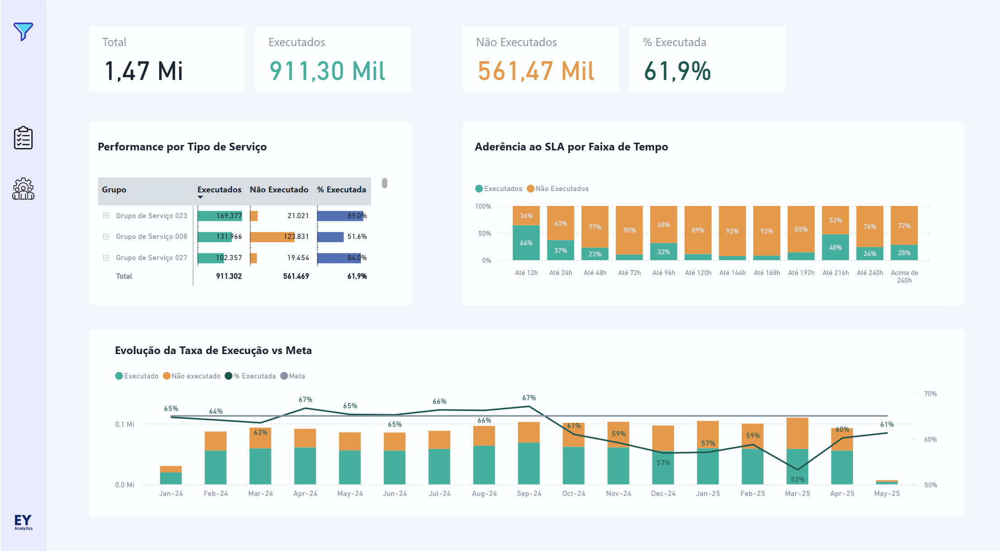
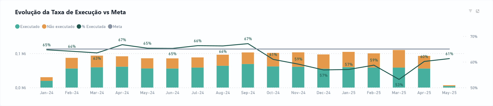

# 📊 Power BI — Análise Operacional e Dimensionamento de Equipes

Este projeto apresenta um **dashboard interativo desenvolvido em Power BI** com foco na **análise operacional de serviços** e no **dimensionamento de equipes**, utilizando dados mascarados para fins de portfólio.

O objetivo é demonstrar como métricas bem definidas e visualizações adequadas podem apoiar decisões relacionadas a **eficiência**, **alocação de recursos** e **priorização operacional**.

---

## 🧭 Como este dashboard deve ser utilizado

Este dashboard foi pensado para responder perguntas como:

- Estamos executando os serviços planejados?
- A taxa de execução está dentro do esperado?
- As equipes estão bem dimensionadas?
- Existem equipes sobrecarregadas ou subutilizadas?
- Em quais períodos o desempenho foi pior?

---

## 📄 Estrutura do Dashboard

O dashboard é composto por **duas páginas principais**, cada uma com um objetivo claro.

---

## 1️⃣ Visão Geral dos Serviços

### 🎯 Objetivo
Fornecer uma visão consolidada do desempenho operacional ao longo do tempo.

---

### 📌 Principais Métricas

| Métrica | Descrição |
|------|---------|
| **Serviços Finalizados** | Total de serviços concluídos no período selecionado |
| **Serviços Executados** | Quantidade de serviços efetivamente executados |
| **Taxa de Execução (%)** | Relação entre serviços executados e finalizados |
| **Meta de Execução** | Valor de referência utilizado para avaliar desempenho |

---

### 📈 Principais Análises

- Evolução temporal da taxa de execução
- Comparação entre execução real e meta
- Distribuição de serviços por tipo
- Identificação de períodos com queda de desempenho

📌 **Como interpretar:**  
Quando a linha de execução permanece abaixo da meta, há indícios de gargalos operacionais, atrasos ou limitação de recursos.

---

## 2️⃣ Dimensionamento de Equipes

### 🎯 Objetivo
Avaliar se as equipes estão **adequadamente dimensionadas**, considerando carga de trabalho e eficiência.

---

### 📌 KPIs de Apoio

| KPI | Significado |
|----|------------|
| **Equipes Ativas** | Número de equipes operando no período |
| **Serviços Finalizados** | Volume total de serviços |
| **Serviços por Equipe** | Média de serviços atribuídos por equipe |
| **% Equipes Abaixo da Meta** | Proporção de equipes com desempenho inferior ao esperado |

---

### 📊 Gráfico Principal — Carga vs Eficiência

Cada ponto do gráfico representa **uma equipe** no período selecionado.

- **Eixo X:** Quantidade média de serviços por equipe (carga)
- **Eixo Y:** Taxa de execução (eficiência)
- **Tamanho da bolha:** Volume total de serviços

Linhas de referência indicam as **metas operacionais**, dividindo o gráfico em quadrantes.

#### 🧠 Leitura dos Quadrantes

- **Superior esquerdo:** Equipes eficientes, porém subutilizadas  
- **Superior direito:** Equipes eficientes e bem dimensionadas  
- **Inferior esquerdo:** Equipes com baixa carga e baixa eficiência  
- **Inferior direito:** Equipes sobrecarregadas e com baixa eficiência  

📌 **Uso prático:**  
Esse gráfico permite identificar rapidamente onde ajustes de alocação, redistribuição ou reforço de equipes podem ser necessários.

---

## 🔐 Sobre os Dados

- Dados totalmente **mascarados e anonimizados**
- Nomes de equipes, serviços, contratos e localidades foram substituídos
- Nenhuma informação sensível ou confidencial foi utilizada

---

## 🌐 Acesse o Dashboard Interativo

👉 **[Clique aqui para abrir o dashboard no Power BI](COLE_AQUI_O_LINK_PUBLICO)**

> Recomenda-se visualizar em tela cheia para melhor experiência.

---

## 👤 Autor

**Erick Eiji Yamazaki**  
Data Analytics | BI | Machine Learning  

